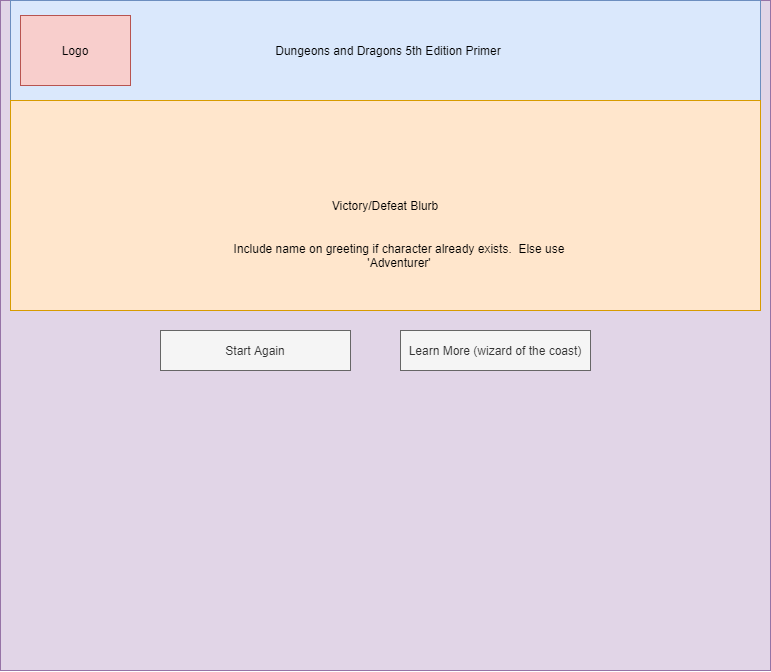
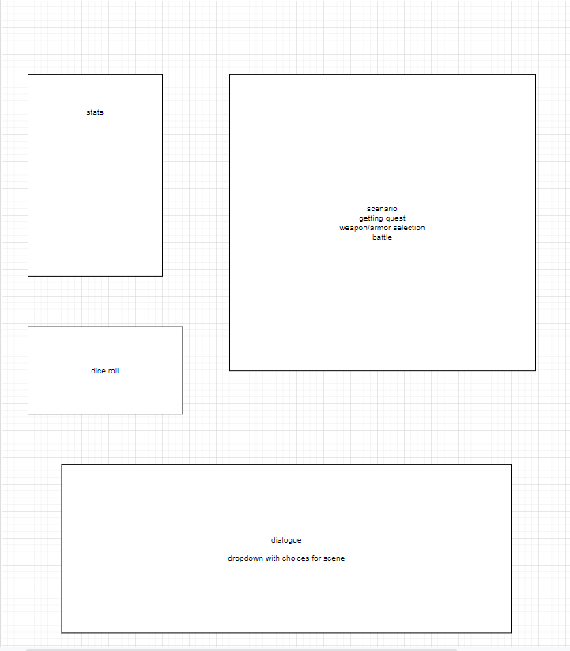
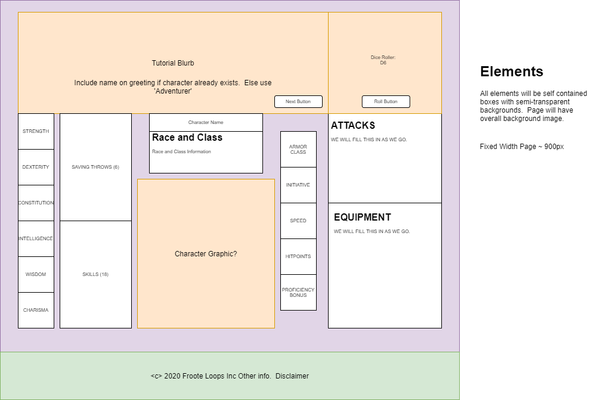
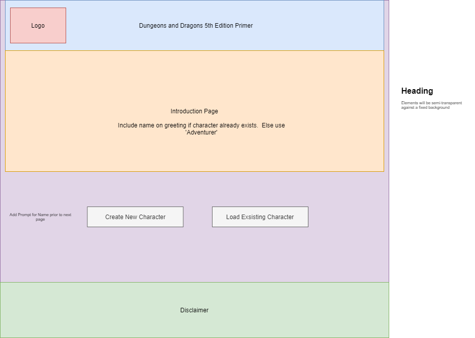

# DnD-primer

Dungeons and Dragons Primer Web Application

## Configuration Requirements

[Configuration Requirements](requirements.md)

## Wire Frames

## User Stories

### User story 1

As a user I would like to be able to play through different guided scenarios so that I know what kinds of decision can be made in the game. As someone who has no experience playing DnD, I would like this app to be very beginner friendly. I would like an introduction to the game, easy to understand instructions and on each level of the game and I would like to have a "help" button or "tips" section readily available if I get stuck. The goal of this application is so people who have never played DnD before can feel like they were able to learn enough about the basic fundamentals of the game to start playing with others!

### User Story 2

As a user, I want the ability to create my own character with either custom stats or pre-designated ones

Feature Tasks:

+ Can spread out my stat points among different attributes
+ Can either type or use arrows to update my stats
+ Have more that 3 stats to update
+ A cool avatar to see stat effects
+ I want to be able to save my character for future use.

Acceptance Tests:

+ User can edit their statistics
+ User types or scrolls to add statistic points
+ At least threes statistics  are available.
+ A picture of the users character is displayed.
+ Characters are able to be saved and recalled when transitioning between pages.

### User Story 3

As a user, I want to practice combat as part of the example scenario.

Feature Tasks:

+ Run at least 3 rounds of combat
+ Use random number generator for dice rolls
+ Use popups to walk the user through basic combat

Acceptance Tests:

+ User can attack and use combat abilities
+ User will be faced with a combatant who can also attack and use abilities
+ Track health and movement

### User Story 4

As a user I would like the game to be enjoyable and not bogged down with too many notifications or pieces of information.

Feature Tasks:

+ Give important information without being too wordy
+ Make sure information comes evenly spread out through the tutorial
+ Include a help button

### User Story 5

As a user I would like an introduction to the purpose of the site

Feature Tasks:

+ a welcome message taking the user's name
+ a description of what DnD is
+ an overview of playable classes with a description of the objective of the game
+ a button to confirm the user is ready to embark on a journey

### Author(s)

+ Kjell Overholt
+ Mariko Alvarado
+ Ricardo Barcenas
+ JP Jones
